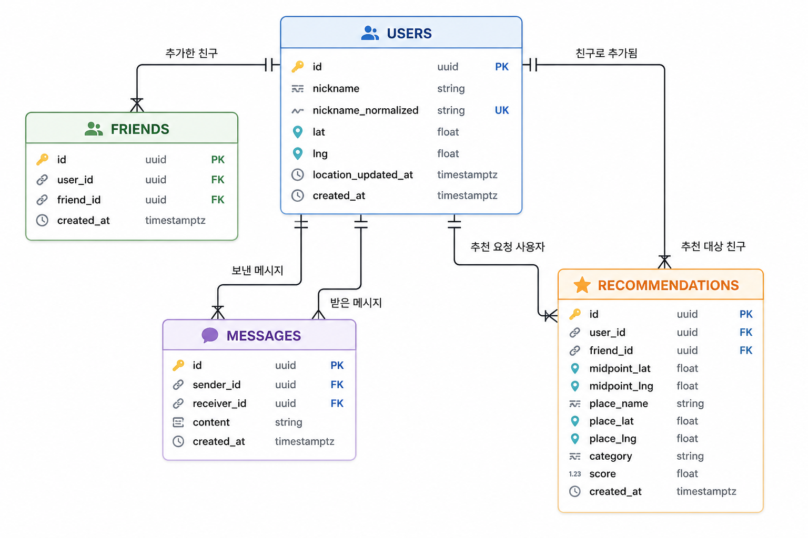

# MeetPoint ERD

## 1\. 문서 목적

이 문서는 MeetPoint MVP의 데이터 구조를 시각적으로 고정하기 위한 ERD 문서이다.

기술 설계 문서에서 정의한 users, friends, messages, departure\_locations 중심 구조를 데이터 관점에서 다시 정리하고, 팀원 간 테이블 관계 해석을 통일하는 것을 목표로 한다.

---

## 2\. ERD 범위

MVP 1차 범위의 기본 데이터 구조는 다음 4개 테이블을 중심으로 구성한다.

*   users
*   friends
*   messages
*   departure\_locations

추가로 recommendations 테이블은 후속 확장용 구조로만 정의하며, MVP 1차에서는 실제 생성 대상에 포함하지 않는다.

---

## 3\. 엔터티 관계 요약

*   users 는 닉네임 기반 계정 정보와 마지막 위치 정보를 저장한다.
*   friends 는 사용자 간 친구 관계를 저장한다.
*   messages 는 두 사용자 간 댓글형 채팅 메시지를 저장한다.
*   departure\_locations 는 나중에 만나기 모드에서 재사용할 저장된 출발 위치를 저장한다.
*   recommendations 는 추천 결과 저장 확장용 테이블이며, 현재 MVP에서는 선택 사항이다.

---

## 4\. Mermaid ERD

Mermaid Live 편집/검증 링크:

*   https://mermaid.live/edit

```
erDiagram
    %% USERS 는 닉네임 기반 계정 식별과 마지막 위치 저장을 담당한다.
    USERS {
        uuid id PK
        string nickname
        string nickname_normalized UK
        string password_hash
        float lat
        float lng
        timestamptz location_updated_at
        timestamptz created_at
    }

    FRIENDS {
        uuid id PK
        uuid user_id FK
        uuid friend_id FK
        timestamptz created_at
    }

    MESSAGES {
        uuid id PK
        uuid sender_id FK
        uuid receiver_id FK
        string content
        timestamptz created_at
    }

    DEPARTURE_LOCATIONS {
        uuid id PK
        uuid user_id FK
        string label
        float lat
        float lng
        string location_kind
        timestamptz last_used_at
        timestamptz created_at
        timestamptz updated_at
    }

    RECOMMENDATIONS {
        uuid id PK
        uuid user_id FK
        uuid friend_id FK
        float midpoint_lat
        float midpoint_lng
        string place_name
        float place_lat
        float place_lng
        string category
        string mode
        float score
        timestamptz created_at
    }

    USERS ||--o{ FRIENDS : "추가한 친구"
    USERS ||--o{ FRIENDS : "친구로 추가됨"
    USERS ||--o{ MESSAGES : "보낸 메시지"
    USERS ||--o{ MESSAGES : "받은 메시지"
    USERS ||--o{ DEPARTURE_LOCATIONS : "저장한 출발 위치"
    USERS ||--o{ RECOMMENDATIONS : "추천 요청 사용자"
    USERS ||--o{ RECOMMENDATIONS : "추천 대상 친구"
```

정적 이미지 미리보기:



주석 및 표기 원칙:

*   Mermaid 내부의 `%%` 주석은 문서 소스에는 남지만 GitHub 렌더링 다이어그램에는 직접 표시되지 않는다.
*   관계선 라벨은 한글로 작성해도 되지만, 테이블명과 컬럼명은 실제 DB 스키마 대응을 위해 영어 식별자를 유지한다.

---

## 5\. 테이블 상세 설명

### 5.1 users

역할:

*   닉네임 기반 계정 식별
*   비밀번호 해시 저장
*   마지막 공유 위치 저장
*   친구 검색과 자기 자신 비교의 기준 데이터 제공
*   지금 만나기 모드의 추천 입력 기준 위치 제공

핵심 컬럼:

*   id
*   nickname
*   nickname\_normalized
*   password\_hash
*   lat
*   lng
*   location\_updated\_at
*   created\_at

제약 기준:

*   nickname\_normalized 는 unique 제약을 가져야 한다.
*   password\_hash 는 평문이 아닌 해시 값만 저장해야 한다.
*   위치 관련 컬럼은 초기 진입 사용자를 위해 null 허용 구조를 유지한다.
*   users 의 lat, lng 는 현재 위치 공유값 용도로 유지하고, 저장된 출발 위치는 departure\_locations 로 분리한다.

### 5.2 friends

역할:

*   사용자와 친구의 관계 저장
*   메시지 조회, 추천 조회 권한 판단의 기준 제공

핵심 컬럼:

*   id
*   user\_id
*   friend\_id
*   created\_at

제약 기준:

*   user\_id 와 friend\_id 는 모두 users.id 를 참조한다.
*   unique(user\_id, friend\_id) 제약을 둔다.
*   check(user\_id \<> friend\_id) 제약을 둔다.
*   친구 추가 성공 시 양방향 row 2건을 함께 유지한다.

### 5.3 messages

역할:

*   두 사용자 간 댓글형 채팅 메시지 저장

핵심 컬럼:

*   id
*   sender\_id
*   receiver\_id
*   content
*   created\_at

제약 기준:

*   sender\_id 와 receiver\_id 는 users.id 를 참조한다.
*   created\_at 오름차순 조회를 기준으로 한다.
*   인덱스는 sender\_id, receiver\_id, created\_at 조합과 반대 방향 조합을 권장한다.

### 5.4 departure\_locations

역할:

*   나중에 만나기 모드에서 재사용할 저장된 출발 위치 저장
*   최근 저장 위치와 사전 등록 위치를 같은 구조 안에서 관리
*   사용자별 출발 위치 목록 조회와 최근 사용 위치 재사용 기준 제공

핵심 컬럼:

*   id
*   user\_id
*   label
*   lat
*   lng
*   location\_kind
*   last\_used\_at
*   created\_at
*   updated\_at

제약 기준:

*   user\_id 는 users.id 를 참조한다.
*   lat, lng 는 실제 추천 입력 좌표로 사용되므로 null 을 허용하지 않는다.
*   label 은 사용자가 구분 가능한 출발 위치 이름이므로 빈 문자열을 허용하지 않는다.
*   location\_kind 는 recent 또는 preset 값만 허용한다.
*   저장된 출발 위치 선택 시 last\_used\_at 을 갱신해 최근 재사용 기준으로 활용한다.

### 5.5 recommendations

역할:

*   향후 추천 결과 이력 저장용 확장 테이블

핵심 컬럼:

*   id
*   user\_id
*   friend\_id
*   midpoint\_lat
*   midpoint\_lng
*   place\_name
*   place\_lat
*   place\_lng
*   category
*   mode
*   score
*   created\_at

주의 사항:

*   MVP 1차에서는 실제 생성 대상이 아니다.
*   MVP 1차 완료 후 추천 이력 저장 필요성을 다시 검토한 뒤 도입 여부를 결정한다.
*   추천 결과 이력 기능이 확정될 때 후속 마이그레이션으로 추가한다.

---

## 6\. 관계 해석 기준

### 6.1 users 와 friends

users 와 friends 는 1:N 구조로 연결되지만, MeetPoint의 친구 관계는 논리적으로 양방향이다.

즉, A 와 B 가 친구가 되면 아래 두 row 를 함께 유지한다.

*   A -> B
*   B -> A

따라서 friends 테이블은 단일 row 로 관계를 표현하는 구조가 아니라, 조회 단순성과 권한 판단 단순화를 위해 방향성이 있는 2개 row 를 함께 저장하는 구조로 이해한다.

### 6.2 users 와 messages

messages 는 sender\_id 와 receiver\_id 를 통해 users 와 각각 연결된다.

한 메시지는 반드시 발신자 1명과 수신자 1명을 가진다. 두 사용자 사이의 메시지 조회는 created\_at asc, id asc 기준으로 정렬한다.

### 6.3 users 와 departure\_locations

departure\_locations 는 users 와 1:N 구조로 연결된다.

한 사용자는 여러 개의 저장된 출발 위치를 가질 수 있다. users 의 lat, lng 가 지금 만나기 모드의 마지막 공유 위치를 나타낸다면, departure\_locations 는 나중에 만나기 모드에서 재사용할 위치 목록을 담당한다.

최근 저장 위치와 사전 등록 위치는 모두 같은 테이블에 저장하되, location\_kind 값으로 구분한다.

### 6.4 users 와 recommendations

recommendations 는 사용자와 친구의 조합에 대한 추천 결과 저장 확장 테이블이다.

현재 MVP에서는 저장하지 않고 즉시 계산 후 응답만 반환하므로, ERD 상에는 후속 확장 구조로만 남긴다.

---

## 7\. MVP 적용 기준

MVP 1차에서 실제 생성 대상은 다음과 같다.

*   users
*   friends
*   messages
*   departure\_locations

MVP 1차에서 생성하지 않는 대상은 다음과 같다.

*   recommendations

이 기준은 기술 설계 문서와 동일하게 유지한다.

### 7.1 recommendations 후속 도입 검토 기준

아래 조건이 확인될 때 recommendations 테이블 도입을 재검토한다.

*   사용자에게 지난 추천 결과를 다시 보여줄 요구가 명확하다.
*   추천 결과를 친구별 또는 날짜별로 조회하는 기능이 필요하다.
*   동일한 추천 결과의 중복 저장 정책과 보관 기간을 정의할 수 있다.
*   추천 품질 개선이나 운영 분석을 위해 DB 저장이 로그 저장보다 더 적합하다.
*   저장 건수 증가를 감당할 인덱스, 정리 정책, 조회 화면 범위를 함께 설계할 수 있다.

---

## 8\. 구현 메모

*   회원가입, 로그인, users 조회, friends 조회, messages 조회는 모두 Next.js Route Handler 를 통해 수행한다.
*   브라우저는 Supabase 직접 쓰기를 하지 않는다.
*   nickname 비교와 중복 검사는 nickname\_normalized 기준으로 처리한다.
*   인증은 JWT를 httpOnly 쿠키에 저장하는 방식으로 처리하며, 닉네임 찾기와 비밀번호 재설정은 MVP에서 제외한다.
*   friends 의 양방향 row 유지 규칙은 ERD 해석 시 반드시 함께 이해해야 한다.
*   users 의 lat, lng 는 현재 위치 공유값 전용으로 사용하고, 저장된 출발 위치 재사용은 departure\_locations 를 기준으로 처리한다.