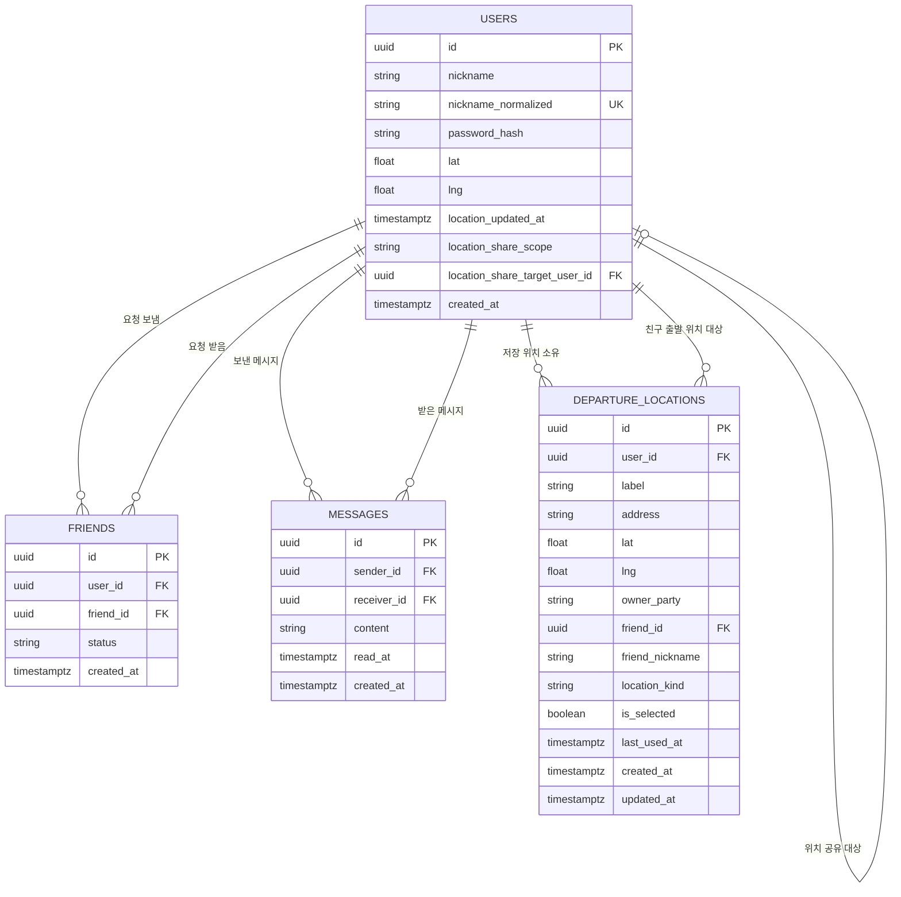

# MeetPoint ERD

## 1. 문서 목적

이 문서는 MeetPoint의 현재 데이터 저장 구조를 시각적으로 고정하기 위한 ERD 문서이다.

현재 구현에는 Supabase 기반 users, friends, messages, departure_locations 스키마와 이를 사용하는 인증, 친구, 메시지, 위치 저장 API 가 포함되어 있으므로, 본 문서는 실제 생성 대상 테이블과 관계를 현재 코드 기준으로 정리하는 것을 목표로 한다.

---

## 2. ERD 범위

현재 ERD 범위는 실제 스키마와 Route Handler 에서 사용하는 아래 4개 테이블이다.

1. users
2. friends
3. messages
4. departure_locations

다음 항목은 현재 ERD 본 범위에서 제외한다.

1. recommendations 테이블
2. 추천 결과 이력 저장 테이블
3. 실시간 이벤트 또는 알림 전용 테이블
4. 비밀번호 재설정 토큰 테이블

### 2.1 현재 구현 대응 관계

1. users 는 계정 정보와 마지막 공유 위치, 위치 공유 범위를 저장한다.
2. friends 는 친구 요청 대기와 수락 상태를 저장한다.
3. messages 는 사용자 간 댓글형 채팅 메시지와 읽음 시각을 저장한다.
4. departure_locations 는 내 출발 위치와 친구 출발 위치용 저장 좌표를 함께 저장한다.

---

## 3. 엔터티 관계 요약

1. users 는 friends, messages, departure_locations 의 기준 엔터티이다.
2. friends 는 동일한 users 테이블을 두 번 참조해 사용자와 친구 대상 사용자를 표현한다.
3. messages 는 sender_id 와 receiver_id 로 users 를 각각 참조한다.
4. departure_locations 는 user_id 로 소유자를 참조하고, friend 소유 저장 위치일 때 friend_id 로 대상 친구를 추가 참조한다.
5. 현재 추천 결과는 계산형 응답 구조이며 DB 엔터티로 저장하지 않는다.

---

## 4. Mermaid ERD

Mermaid Live 편집/검증 링크:

1. https://mermaid.live/edit

---

## 5. 테이블 상세 설명

### 5.1 users

역할:

1. 닉네임 기반 계정 식별
2. 비밀번호 해시 저장
3. 마지막 공유 위치 저장
4. 현재 위치 공유 범위 저장
5. 인증과 보호 API 사용자 식별의 기준 제공

핵심 컬럼:

1. id
2. nickname
3. nickname_normalized
4. password_hash
5. lat
6. lng
7. location_updated_at
8. location_share_scope
9. location_share_target_user_id
10. created_at

제약 기준:

1. nickname_normalized 는 unique 제약을 가진다.
2. location_share_scope 는 friend 또는 all_friends 만 허용한다.
3. friend 범위 공유일 때 location_share_target_user_id 는 users.id 를 참조한다.
4. 위치 관련 컬럼은 미공유 사용자를 위해 null 허용 구조를 유지한다.

### 5.2 friends

역할:

1. 친구 요청 생성
2. 받은 요청과 보낸 요청 조회
3. 수락된 친구 관계 조회
4. 메시지 및 추천 권한 판단 기준 제공

핵심 컬럼:

1. id
2. user_id
3. friend_id
4. status
5. created_at

제약 기준:

1. user_id 와 friend_id 는 모두 users.id 를 참조한다.
2. status 는 pending 또는 accepted 만 허용한다.
3. unique(user_id, friend_id) 제약으로 중복 관계를 막는다.
4. check(user_id <> friend_id) 로 자기 자신 친구 요청을 막는다.

### 5.3 messages

역할:

1. 두 사용자 간 댓글형 채팅 메시지 저장
2. 읽음 시각 추적
3. 커서 기반 메시지 조회의 기준 제공

핵심 컬럼:

1. id
2. sender_id
3. receiver_id
4. content
5. read_at
6. created_at

제약 기준:

1. sender_id 와 receiver_id 는 users.id 를 참조한다.
2. content 는 trim 후 1자 이상이어야 한다.
3. read_at 은 미확인 메시지를 위해 null 을 허용한다.

### 5.4 departure_locations

역할:

1. 나중에 만나기 모드에서 사용할 저장 출발 위치 저장
2. 내 출발 위치와 친구 출발 위치용 저장을 하나의 구조로 관리
3. 최근 사용 위치와 preset 위치를 함께 관리
4. 현재 선택된 저장 위치 상태 유지

핵심 컬럼:

1. id
2. user_id
3. label
4. address
5. lat
6. lng
7. owner_party
8. friend_id
9. friend_nickname
10. location_kind
11. is_selected
12. last_used_at
13. created_at
14. updated_at

제약 기준:

1. owner_party 는 me 또는 friend 만 허용한다.
2. owner_party 가 me 이면 friend_id 와 friend_nickname 은 null 이어야 한다.
3. owner_party 가 friend 이면 friend_id 와 friend_nickname 이 모두 필요하다.
4. location_kind 는 recent 또는 preset 만 허용한다.
5. label 은 빈 문자열을 허용하지 않는다.
6. friend_id 는 users.id 를 참조한다.

---

## 6. 관계 해석 기준

### 6.1 users 와 friends

1. 친구 요청은 단일 pending row 로 시작한다.
2. 요청 수락 후에는 양방향 accepted 관계를 유지한다.
3. 따라서 friends 는 논리적으로 양방향 친구 관계를 방향성 있는 row 집합으로 저장한다.

### 6.2 users 와 messages

1. 각 메시지는 발신자 1명과 수신자 1명을 가진다.
2. 두 사용자 간 메시지는 created_at asc, id asc 기준으로 조회한다.
3. read_at 은 수신자가 읽은 마지막 시각을 저장한다.

### 6.3 users 와 departure_locations

1. 한 사용자는 여러 저장 위치를 가질 수 있다.
2. friend 소유 저장 위치는 같은 소유자 아래에서 특정 친구별 그룹으로 묶인다.
3. is_selected 는 같은 사용자와 owner_party, friend_id 그룹 안에서 현재 활성 위치를 나타낸다.

---

## 7. 현재 적용 기준

현재 실제 생성 및 사용 대상은 다음과 같다.

1. users
2. friends
3. messages
4. departure_locations

현재 생성하지 않는 대상은 다음과 같다.

1. recommendations

이 기준은 현재 DB 스키마 문서와 API 명세서의 구현 상태와 동일하게 유지한다.

---

## 8. 후속 메모

1. 추천 결과 이력 저장 요구가 생기면 recommendations 테이블을 별도 설계한다.
2. 친구 요청 수락과 저장 위치 선택 상태 갱신은 트랜잭션 또는 DB 함수로 유지하는 것이 안전하다.
3. 위치 공유 이력이 필요해지면 users 단일 컬럼 구조에서 별도 history 테이블 분리를 검토한다.
