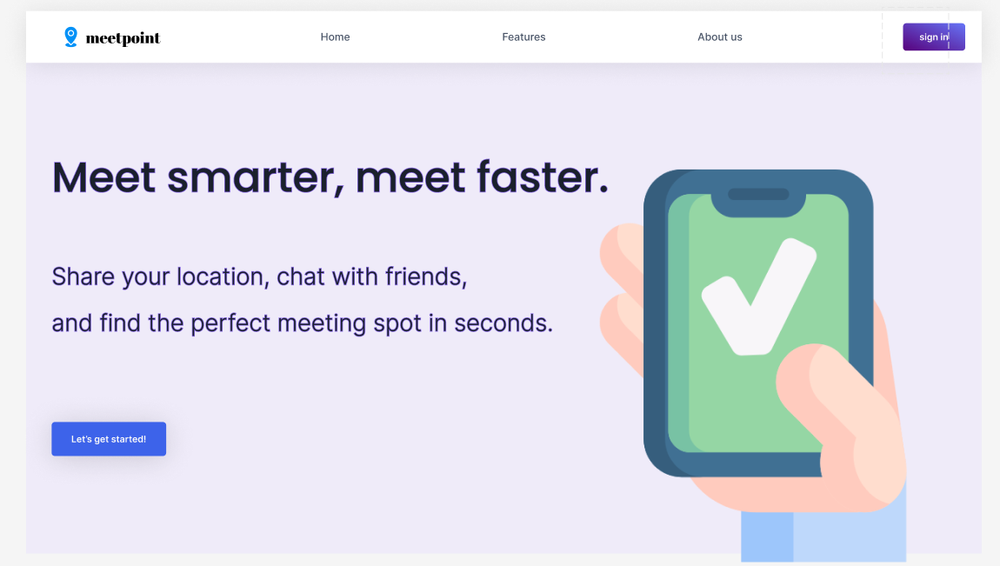
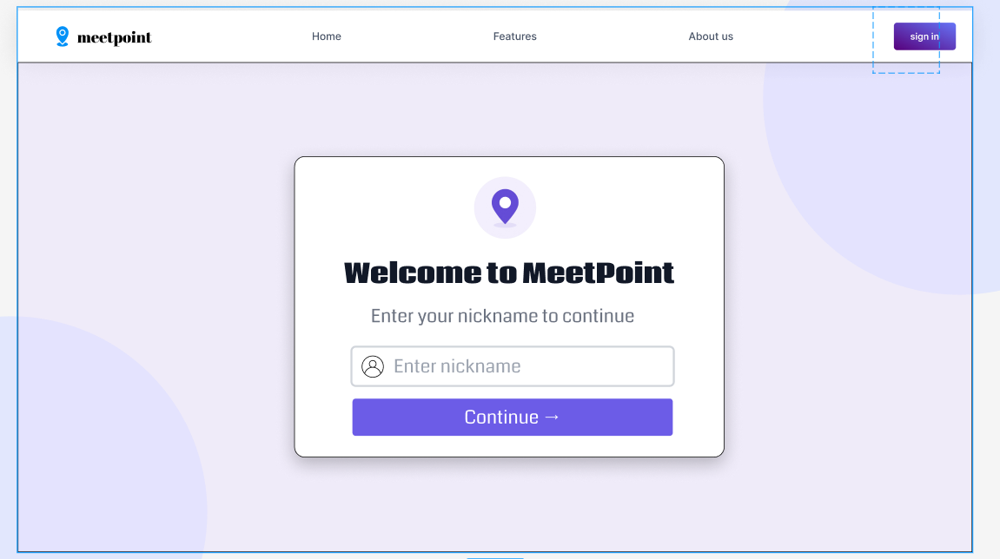
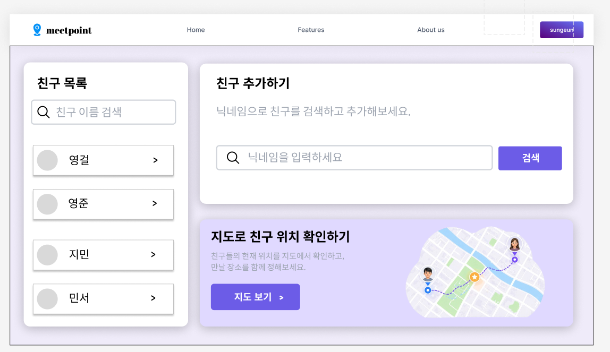
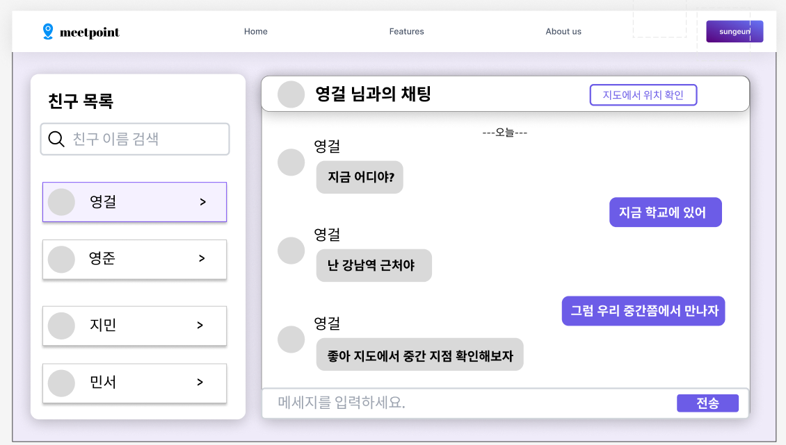

# MeetPoint 화면 명세서

## 1\. 문서 목적

이 문서는 MeetPoint MVP 1차 구현에 필요한 화면 구성을 고정하기 위한 문서이다.

기획 문서, 기술 설계 문서, API 명세서에서 정의한 기능을 실제 사용자 화면 기준으로 다시 정리하여, 어떤 화면이 필요하고 각 화면에서 무엇을 보여 주며 어떤 행동을 처리해야 하는지를 한 번에 이해할 수 있도록 만드는 것을 목표로 한다.

현재 문서는 팀 A의 실제 퍼블리싱 구조를 기준으로 라우팅과 화면 책임을 정리한다.

---

## 2\. 범위

본 문서는 아래 항목을 포함한다.

1.  랜딩 화면
2.  로그인 화면
3.  회원가입 화면
4.  friends 허브 화면
5.  chat 상세 화면
6.  추천 결과 강조 상태
7.  features 소개 화면
8.  about 소개 화면
9.  빈 상태, 오류 상태, 로딩 상태
10. 화면 간 이동 흐름

본 문서의 기본 범위에서 제외하는 항목은 아래와 같다.

1.  WebSocket 기반 실시간 소켓 UI 세부 설계
2.  비밀번호 재설정 화면
3.  닉네임 찾기 화면
4.  관리자 화면
5.  추천 이력 전용 화면

---

## 3\. 화면 설계 기준

### 3.1 기준 시안

현재 화면 명세는 전달받은 간단한 피그마 시안을 기준으로 정리한다.

아래 이미지는 이번 화면 명세에서 참고하는 시안들이다.

#### 시안 A. 서비스 첫 인상 화면



이 시안은 실제 기능 화면이라기보다 서비스의 첫 인상과 랜딩 톤을 보여 주는 참고 이미지이다.

#### 시안 B. 시작 화면 입력 카드



이 시안은 중앙 인증 카드형 입력 화면 분위기를 보여 주는 참고 이미지이다.

#### 시안 C. 메인 기본 화면



이 시안은 친구 목록과 우측 콘텐츠 영역이 나뉜 허브형 화면 구조를 보여 준다.

#### 시안 D. 친구 선택 상세 화면



이 시안은 친구를 선택한 뒤 채팅 중심 상태로 확장되는 상세 화면 방향을 보여 준다.

### 3.2 현재 퍼블 기준과 추가 구현 예정 기능 구분

현재 퍼블 기준 라우팅은 아래와 같다.

1.  /
2.  /login
3.  /signup
4.  /friends
5.  /chat
6.  /features
7.  /about

중요한 점은 아래와 같다.

1.  현재 퍼블 구조를 문서의 현재 기준으로 사용한다.
2.  기존에 통합 메인 화면 내부 상태로 정의했던 친구, 채팅, 위치, 추천 기능 요구사항은 삭제하지 않는다.
3.  해당 기능은 friends 화면, chat 화면, 그리고 chat 내부 상태 확장으로 재배치한다.
4.  추가 구현 예정 기능은 현재 퍼블 구조와 구분해 별도 메모로 관리한다.

### 3.3 공통 UI 방향

1.  상단에는 공통 헤더를 둔다.
2.  본문은 카드형 구획과 명확한 섹션 분리로 구성한다.
3.  발표 시연 기준으로 각 화면의 핵심 흐름이 바로 보이도록 한다.
4.  데이터가 없는 상태와 오류 상태를 숨기지 않고 분명하게 보여 준다.

---

## 4\. 전체 화면 목록

| 화면 ID | 화면명              | 경로      | 인증 필요 | 설명                                                             |
| ------- | ------------------- | --------- | --------- | ---------------------------------------------------------------- |
| SCR-01  | 랜딩 화면           | /         | 아니오    | 서비스 소개, CTA, public 내비게이션을 보여 주는 시작 화면        |
| SCR-02  | 로그인 화면         | /login    | 아니오    | 닉네임과 비밀번호로 로그인하는 인증 화면                         |
| SCR-03  | 회원가입 화면       | /signup   | 아니오    | 닉네임과 비밀번호로 회원가입하는 인증 화면                       |
| SCR-04  | friends 허브 화면   | /friends  | 예        | 친구 목록, 친구 추가, 기본 안내와 상세 진입을 담당하는 허브 화면 |
| SCR-05  | chat 상세 화면      | /chat     | 예        | 선택한 친구 기준 채팅, 위치 상태, 추천 입력을 담당하는 핵심 화면 |
| SCR-06  | 추천 결과 강조 상태 | /chat     | 예        | 추천 요청 후 중심점과 추천 장소 3개를 강조 표시한 chat 내부 상태 |
| SCR-07  | features 소개 화면  | /features | 아니오    | 서비스 특징과 가치 설명을 보여 주는 소개 화면                    |
| SCR-08  | about 소개 화면     | /about    | 아니오    | 팀 또는 서비스 배경 설명을 보여 주는 소개 화면                   |

중요한 점은 SCR-05와 SCR-06이 완전히 다른 페이지라기보다, chat 페이지 내부 상태 변화로 동작할 수 있다는 점이다.

---

## 5\. 공통 레이아웃 명세

### 5.1 공통 헤더

모든 주요 화면 상단에는 공통 헤더를 둔다.

현재 퍼블 기준 구성 요소는 아래와 같다.

1.  서비스 로고 또는 MeetPoint 텍스트
2.  public 구간 내비게이션: Home, Features, About us
3.  in-app 구간 보조 내비게이션: Friends, Chat
4.  우측 인증 액션 버튼: sign in 또는 sign up

설계 메모:

1.  public 구간에서는 소개용 내비게이션을 우선 표시한다.
2.  friends, chat 구간에서는 in-app 이동 진입점이 함께 노출될 수 있다.
3.  향후 로그인 상태 표시나 로그아웃 버튼은 보호 화면 확장 시 추가할 수 있다.

### 5.2 본문 레이아웃

1.  랜딩 화면은 소개 텍스트와 대표 CTA 중심 구조를 사용한다.
2.  로그인과 회원가입 화면은 중앙 카드 정렬 구조를 사용한다.
3.  friends 화면은 좌측 친구 패널 + 우측 허브 콘텐츠 구조를 사용한다.
4.  chat 화면은 친구 선택 상세 상태에 맞춰 채팅, 위치, 추천 입력과 결과 영역을 함께 확장할 수 있어야 한다.

---

## 6\. SCR-01 랜딩 화면 명세

### 6.1 화면 목적

사용자가 서비스에 처음 진입했을 때 브랜드 인상과 핵심 가치를 확인하고, 다음 행동으로 이동하는 화면이다.

### 6.2 화면 구성

1.  서비스 헤드라인
2.  서비스 설명 문구
3.  대표 CTA 버튼
4.  시각적 대표 일러스트 또는 이미지

### 6.3 사용자 액션

| 액션                   | 설명             | 결과                                                                     |
| ---------------------- | ---------------- | ------------------------------------------------------------------------ |
| Let's get started 클릭 | 시작 CTA 선택    | 비로그인 사용자는 /login 으로 이동하고, 로그인 사용자는 /friends 로 이동 |
| Features 클릭          | 소개 화면 이동   | /features 이동                                                           |
| About us 클릭          | 소개 화면 이동   | /about 이동                                                              |
| sign in 클릭           | 로그인 화면 이동 | /login 이동                                                              |

### 6.4 화면 메모

1.  랜딩 화면은 인증 입력 화면이 아니라 public 시작 화면이다.
2.  서비스 첫 인상과 라우팅 분기를 담당한다.
3.  로그인 여부에 따른 CTA 분기 로직이 필요하다.

---

## 7\. SCR-02 로그인 화면 명세

### 7.1 화면 목적

기존 사용자가 닉네임과 비밀번호로 로그인하는 인증 화면이다.

### 7.2 화면 구성

1.  중앙 인증 카드
2.  서비스 환영 문구
3.  닉네임 입력 필드
4.  비밀번호 입력 필드
5.  로그인 버튼
6.  회원가입 화면 이동 링크
7.  검증 또는 오류 문구 영역

### 7.3 표시 데이터

| 항목          | 형식           | 설명                         |
| ------------- | -------------- | ---------------------------- |
| nickname      | text input     | 사용자가 입력하는 닉네임     |
| password      | password input | 사용자가 입력하는 비밀번호   |
| error message | text           | 검증 실패 또는 API 실패 안내 |

### 7.4 사용자 액션

| 액션              | 설명               | 결과                                   |
| ----------------- | ------------------ | -------------------------------------- |
| 닉네임 입력       | 닉네임 작성        | 내부 상태 갱신                         |
| 비밀번호 입력     | 비밀번호 작성      | 내부 상태 갱신                         |
| 로그인 클릭       | 로그인 요청        | 성공 시 JWT 쿠키 발급 후 /friends 이동 |
| sign up 링크 클릭 | 회원가입 화면 이동 | /signup 이동                           |

---

## 8\. SCR-03 회원가입 화면 명세

### 8.1 화면 목적

새 사용자가 닉네임과 비밀번호로 회원가입하는 인증 화면이다.

### 8.2 화면 구성

1.  중앙 인증 카드
2.  서비스 안내 문구
3.  닉네임 입력 필드
4.  비밀번호 입력 필드
5.  비밀번호 확인 필드
6.  회원가입 버튼
7.  로그인 화면 이동 링크
8.  검증 또는 오류 문구 영역

### 8.3 사용자 액션

| 액션               | 설명             | 결과                                   |
| ------------------ | ---------------- | -------------------------------------- |
| 닉네임 입력        | 닉네임 작성      | 내부 상태 갱신                         |
| 비밀번호 입력      | 비밀번호 작성    | 내부 상태 갱신                         |
| 비밀번호 확인 입력 | 확인값 작성      | 내부 상태 갱신                         |
| 회원가입 클릭      | 회원가입 요청    | 성공 시 JWT 쿠키 발급 후 /friends 이동 |
| sign in 링크 클릭  | 로그인 화면 이동 | /login 이동                            |

---

## 9\. SCR-04 friends 허브 화면 명세

### 9.1 화면 목적

로그인 이후 사용자가 친구 목록을 보고, 친구를 추가하고, chat 상세 화면으로 진입하는 기본 허브 화면이다.

### 9.2 전체 구조

friends 화면은 크게 두 영역으로 나뉜다.

1.  좌측 친구 패널
2.  우측 허브 콘텐츠 패널

### 9.3 좌측 친구 패널 구성

1.  친구 목록 제목
2.  친구 검색 또는 필터 입력창
3.  친구 목록 카드 반복

각 친구 카드에는 아래 정보가 들어간다.

1.  프로필 플레이스홀더 또는 아바타
2.  친구 닉네임
3.  chat 화면 이동 액션

### 9.4 우측 허브 콘텐츠 구성

현재 퍼블 기준으로 friends 화면 우측 콘텐츠는 아래를 포함한다.

1.  친구 추가 카드
2.  친구 추가 입력 필드
3.  친구 추가 결과 또는 안내 문구
4.  상세 화면 진입 전 기본 허브 안내 영역

추가 구현 예정 메모:

1.  지도 진입 카드 또는 요약 카드
2.  선택된 친구가 없을 때 추천 기능 안내 영역

### 9.5 사용자 액션

| 액션                | 설명                | 결과                   |
| ------------------- | ------------------- | ---------------------- |
| 친구 검색 입력      | 친구 목록 필터      | 목록 필터링            |
| 친구 추가 입력      | 새 친구 닉네임 입력 | POST /api/friends 준비 |
| 친구 추가 버튼 클릭 | 친구 추가 요청      | 성공 시 목록 갱신      |
| 친구 카드 클릭      | 상세 화면 진입      | /chat?friend={id} 이동 |

### 9.6 상태 정의

#### 기본 상태

친구 목록과 친구 추가 카드가 보이지만 아직 상세 화면으로 이동하지 않은 상태이다.

#### 친구 없음 상태

1.  아직 추가된 친구가 없습니다.
2.  닉네임으로 친구를 검색해 추가해 보세요.

#### 친구 추가 실패 상태

1.  존재하지 않는 닉네임
2.  자기 자신 추가 시도
3.  이미 추가된 친구
4.  서버 오류

---

## 10\. SCR-05 chat 상세 화면 명세

### 10.1 화면 목적

특정 친구를 선택한 뒤 채팅, 위치 확인, 추천 요청까지 이어지는 핵심 사용 화면이다.

### 10.2 구성 영역

chat 화면은 아래 블록을 포함해야 한다.

1.  선택한 친구 정보 영역
2.  채팅 패널
3.  위치 상태 영역
4.  만남 모드 및 추천 입력 영역
5.  지도 카드 또는 지도 진입 영역
6.  추천 버튼 또는 추천 결과 영역

### 10.3 채팅 패널

채팅 패널은 아래 구조를 가진다.

1.  메시지 목록
2.  메시지 입력창
3.  전송 버튼

메시지는 댓글형 저장 방식이며, 최신 대화 흐름을 시간순으로 보여 준다.

### 10.4 만남 모드 및 추천 입력 영역

구성 요소는 아래와 같다.

1.  지금 만나기 또는 나중에 만나기 토글
2.  나중에 만나기 모드에서 사용하는 출발 위치 입력 블록
3.  카페, 식사, 놀거리 카테고리 선택 버튼
4.  추천 가능 여부를 설명하는 안내 문구

지금 만나기 모드에서는 위치 공유 버튼과 위치 상태 문구를 추천 입력의 핵심 요소로 사용한다. 나중에 만나기 모드에서는 현재 위치 공유 여부와 별개로 출발 위치 입력 또는 저장된 출발 위치 선택값을 우선 사용한다.

### 10.5 출발 위치 입력 영역

나중에 만나기 모드에서만 노출하며, 아래 세 방식 중 하나로 출발 위치를 정할 수 있어야 한다.

1.  주소 검색 결과 선택
2.  지도 핀 지정
3.  저장된 출발 위치 선택

### 10.6 위치 상태 영역

구성 요소는 아래와 같다.

1.  내 위치 상태 문구
2.  친구 위치 상태 문구
3.  마지막 위치 공유 시각
4.  위치 공유 버튼

### 10.7 사용자 액션

| 액션           | 설명                    | 결과                     |
| -------------- | ----------------------- | ------------------------ |
| 메시지 입력    | 댓글 내용 입력          | 내부 상태 갱신           |
| 전송 클릭      | 메시지 저장 요청        | 목록 갱신                |
| 위치 공유 클릭 | 현재 위치 저장 요청     | 상태 문구와 지도 갱신    |
| 만남 모드 선택 | now 또는 later 선택     | 필요한 입력 UI 전환      |
| 주소 검색 입력 | 출발 위치 검색어 입력   | 검색 결과 목록 갱신      |
| 저장 위치 선택 | 저장된 출발 위치 재사용 | 선택 상태 갱신           |
| 카테고리 선택  | 목적 카테고리 선택      | 추천 요청 가능 상태 갱신 |
| 추천 클릭      | 추천 결과 요청          | SCR-06 상태로 확장       |

---

## 11\. SCR-06 추천 결과 강조 상태 명세

### 11.1 화면 목적

chat 화면 안에서 두 사람의 위치를 기준으로 중간 지점과 추천 장소 3개를 시각적으로 확인하는 상태이다.

### 11.2 표시 항목

| 항목        | 형식        | 설명                            |
| ----------- | ----------- | ------------------------------- |
| summary     | object      | mode, category, radiusUsed 요약 |
| midpoint    | object      | 계산된 중심 좌표                |
| places[]    | card list   | 추천 장소 3개 목록              |
| map markers | map overlay | 중심점 및 추천 장소 마커        |

### 11.3 지도 표시 규칙

추천이 완료되면 지도에는 아래 마커를 함께 표시한다.

1.  현재 사용자 위치
2.  친구 위치
3.  중심점
4.  추천 장소 마커 3개

### 11.4 빈 결과 상태

1.  추천 가능한 장소를 찾지 못했습니다.
2.  위치를 다시 공유하거나 다른 친구를 선택해 보세요.

---

## 12\. SCR-07 features 소개 화면 명세

### 12.1 화면 목적

서비스 특징, 가치 제안, 핵심 기능 요약을 public 화면으로 소개한다.

### 12.2 구성 요소

1.  서비스 특징 요약 섹션
2.  핵심 기능 카드 또는 설명 블록
3.  랜딩 또는 로그인 화면으로 이동 가능한 CTA

---

## 13\. SCR-08 about 소개 화면 명세

### 13.1 화면 목적

서비스 배경, 팀 또는 프로젝트 소개를 public 화면으로 제공한다.

### 13.2 구성 요소

1.  서비스 소개 문구
2.  프로젝트 배경 또는 팀 설명 블록
3.  랜딩 또는 로그인 화면으로 이동 가능한 CTA

---

## 14\. 화면 간 이동 흐름

### 14.1 기본 사용자 흐름

```text
랜딩 화면
    -> Let's get started 클릭
    -> 비로그인: 로그인 화면
    -> 로그인 성공: friends 허브 화면
    -> 친구 선택
    -> chat 상세 화면
    -> 위치 공유 또는 출발 위치 입력
    -> 추천 요청
    -> 추천 결과 강조 상태
```

### 14.2 보호 페이지 이동 규칙

1.  JWT 쿠키가 없으면 /friends, /chat 진입 시 /login 또는 / 로 유도한다.
2.  JWT가 유효하면 /friends 와 /chat 진입이 가능하다.
3.  로그인 또는 회원가입 성공 시 기본 이동 경로는 /friends 이다.
4.  로그아웃 시 public 시작 화면으로 되돌아간다.

---

## 15\. 공통 상태 명세

### 15.1 로딩 상태

아래 작업은 로딩 상태 표시가 필요하다.

1.  회원가입
2.  로그인
3.  친구 추가
4.  친구 목록 초기 조회
5.  메시지 조회
6.  메시지 전송
7.  위치 저장
8.  출발 위치 검색
9.  저장된 출발 위치 목록 조회
10. 저장된 출발 위치 저장 또는 사용 시각 갱신
11. 추천 결과 조회

### 15.2 오류 상태

오류는 가능한 한 사용자 행동 위치에 가까운 곳에서 보여 준다.

예시:

1.  인증 오류는 login 또는 signup 카드 내부
2.  친구 추가 오류는 friends 화면 카드 내부
3.  메시지 전송 오류는 chat 패널 하단
4.  추천 오류는 추천 버튼 또는 추천 결과 영역 근처

### 15.3 빈 상태

빈 상태는 아래를 포함한다.

1.  친구 없음
2.  메시지 없음
3.  추천 결과 없음
4.  위치 없음
5.  친구 미선택
6.  저장된 출발 위치 없음
7.  출발 위치 검색 결과 없음

---

## 16\. 반응형 및 레이아웃 원칙

MVP 기준 기본 설계는 데스크톱 우선이지만, 최소한 아래 원칙은 지켜야 한다.

1.  좁은 화면에서는 friends 좌측 패널이 상단 또는 접이식 영역으로 재배치될 수 있어야 한다.
2.  지도, 채팅, 추천 카드가 겹쳐서 읽기 어렵지 않아야 한다.
3.  버튼과 입력창은 모바일에서도 누르기 가능한 크기를 유지해야 한다.

---

## 17\. 컴포넌트 대응 기준

현재 퍼블 구조 기준으로 화면과 주요 컴포넌트 매핑은 아래와 같다.

| 화면 영역          | 주요 컴포넌트                                |
| ------------------ | -------------------------------------------- |
| 랜딩 화면          | app/components/home-hero.tsx                 |
| 공통 헤더          | app/components/main-header.tsx               |
| 로그인 화면        | app/components/auth-screen.tsx               |
| 회원가입 화면      | app/components/auth-screen.tsx               |
| friends 허브 화면  | app/components/friends-screen.tsx            |
| 친구 목록 패널     | app/components/friends/friends-sidebar.tsx   |
| 친구 허브 콘텐츠   | app/components/friends/friends-content.tsx   |
| chat 상세 화면     | app/components/chat-screen.tsx               |
| chat 상태 관리     | app/components/chat/use-chat-screen-state.ts |
| features 소개 화면 | app/components/features/features-content.tsx |
| about 소개 화면    | app/components/about/about-content.tsx       |

추가 구현 예정 컴포넌트 메모:

1.  저장된 출발 위치 입력 컴포넌트
2.  카테고리 선택 컴포넌트
3.  추천 기준 요약 컴포넌트
4.  지도 결과 강조 컴포넌트

---

## 18\. MVP 화면 구현 우선순위

### 18.1 1차 우선 구현

1.  랜딩 화면
2.  로그인 화면
3.  회원가입 화면
4.  friends 허브 화면
5.  chat 기본 구조

### 18.2 2차 우선 구현

1.  위치 공유 상태 표시
2.  지도 렌더링
3.  친구 선택 상태 동기화

### 18.3 3차 우선 구현

1.  나중에 만나기 입력 UI
2.  추천 결과 카드 3개 표시
3.  중심점 및 추천 마커 표시
4.  추천 결과 빈 상태 및 오류 상태

---

## 19\. 화면 명세 확정 기준

이 문서 기준 화면 설계가 충족되었다고 보려면 아래 조건을 만족해야 한다.

1.  랜딩 화면 CTA가 로그인 여부에 따라 /login 또는 /friends 로 분기되어야 한다.
2.  login 과 signup 화면이 분리되어 있어야 한다.
3.  friends 화면에서 친구 목록과 친구 추가 흐름이 동작해야 한다.
4.  chat 화면에서 채팅, 위치, 추천 입력 또는 추천 결과 흐름이 이어져야 한다.
5.  features 와 about 화면이 public 소개 화면으로 동작해야 한다.
6.  현재 퍼블 구조와 추가 구현 예정 기능이 문서에서 구분되어 있어야 한다.
