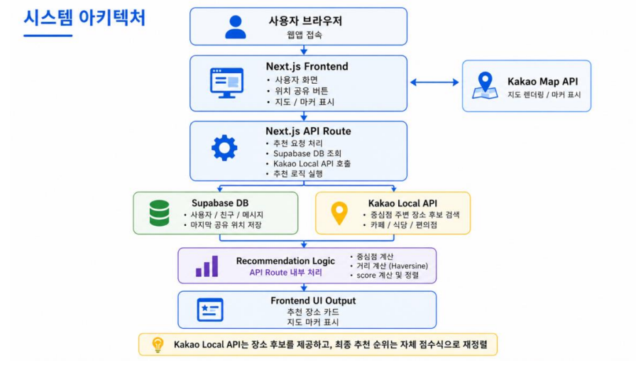

# MeetPoint 발표 자료

## 슬라이드 1. 서비스 소개

### 제목

MeetPoint

### 한 줄 소개

친구와 위치를 공유하고, 중간 지점 근처 약속 장소를 공정하게 추천해주는 웹 서비스

### 핵심 메시지

기존에는 메신저, 지도, 장소 검색을 따로 써야 했지만, MeetPoint는 이 과정을 하나의 흐름으로 통합한다.

### 발표 멘트

안녕하세요, 저희 팀의 프로젝트 MeetPoint를 소개하겠습니다.  
MeetPoint는 친구와 위치를 공유하고, 두 사람의 중간 지점 근처 약속 장소를 공정하게 추천해주는 웹 서비스입니다.  
기존에 여러 앱을 오가야 했던 과정을 하나의 흐름으로 줄이는 것이 저희 서비스의 출발점입니다.

---

## 슬라이드 2. 문제와 해결 방향

### 문제

*   메신저, 지도, 장소 검색 서비스를 따로 써야 해서 약속 장소를 정하는 과정이 번거롭다.
*   서로 다른 위치에 있는 두 사람이 공정한 만남 장소를 빠르게 정하기 어렵다.
*   단순 장소 검색만으로는 두 사람 모두에게 적절한 위치인지 판단하기 어렵다.

### 해결 방향

*   통합성: 채팅, 위치 공유, 장소 추천을 한 흐름으로 제공한다.
*   공정성: 한 사람에게만 유리한 장소가 아니라 두 사람 모두에게 적절한 장소를 추천한다.
*   단순성: 최소한의 회원가입과 로그인만 두고, 실시간 처리 없이도 핵심 경험을 빠르게 제공한다.

### 발표 멘트

기존 약속 준비 과정은 대화, 위치 확인, 장소 검색이 분리되어 있어 번거롭습니다.  
특히 서로 다른 위치에서 출발할 때는 어디서 만나는 것이 공정한지 빠르게 판단하기 어렵습니다.  
저희는 이 문제를 통합성, 공정성, 단순성이라는 세 가지 방향으로 해결하고자 했습니다.

---

## 슬라이드 3. 핵심 사용자 흐름

### 사용자 흐름

1.  사용자가 랜딩 화면에서 로그인 또는 회원가입 UI로 이동한다.
2.  friends 화면에서 친구 닉네임을 입력해 로컬 친구 목록에 추가한다.
3.  친구를 선택해 chat 상세 화면으로 이동하고 댓글형 채팅 UI를 확인한다.
4.  chat 화면에서 지금 만나기 또는 나중에 만나기 모드를 선택한다.
5.  지금 만나기에서는 위치 공유 버튼으로 상태를 갱신하고, 나중에 만나기에서는 주소 검색, 핀 지정, 저장 위치 선택으로 출발 위치를 정한다.
6.  카테고리를 선택한 뒤 추천 버튼을 눌러 추천 카드, 지도 패널, 요약 패널을 확인한다.
7.  chat 화면의 지도, 카드 UI, 추천 기준 요약을 보고 약속 장소를 결정하는 흐름을 데모한다.

### 핵심 메시지

현재 데모 기준으로 사용자는 friends 허브에서 친구를 고르고, chat 상세 화면에서 대화, 위치 확인, 출발 위치 선택, 장소 추천 UI까지 하나의 흐름으로 확인할 수 있다.

### 발표 멘트

사용자는 먼저 랜딩 화면에서 로그인 또는 회원가입 UI로 이동한 뒤 friends 화면에서 친구를 추가합니다.  
이후 친구를 선택해 chat 화면으로 이동하고, 채팅 UI를 확인하면서 지금 만나기인지 나중에 만나기인지 모드를 고른 다음 필요한 위치 입력을 마치면 추천 버튼 한 번으로 추천 카드와 지도 패널을 바로 확인할 수 있습니다.  
즉, 사용 흐름이 끊기지 않도록 friends 허브와 chat 상세 화면이 역할을 나눠 약속 장소를 정하는 핵심 단계를 이어 줍니다.

---

## 슬라이드 4. 추천 로직 설계와 현재 데모

### 동작 방식

현재 Team A 데모에서는 추천 버튼을 누르면 선택한 mode, category, 출발 위치 입력값을 기준으로 recommendation summary, 추천 카드 10개, 지도 패널을 로컬 상태와 더미데이터로 갱신한다. 즉, 화면 데모에서는 추천 입력 흐름과 결과 표현을 먼저 검증한다.

현재 backend 기준 추천 로직은 아래와 같다. 지금 만나기 모드에서는 사용자와 친구의 마지막 공유 위치를 사용하고, 나중에 만나기 모드에서는 주소 검색, 핀 지정, 저장된 출발 위치 선택값을 사용한다. 이후 두 좌표의 중심점을 계산하고, Kakao Local API로 중심점 주변 장소 후보를 1km, 2km, 3km 순서로 확장 조회한다. 가져온 후보는 그대로 보여주지 않고, 각 사용자와 장소 사이의 거리를 계산한 뒤 자체 점수식으로 다시 정렬한다.

### 추천 점수

```
score = 평균 이동거리 + 거리 편차 + 카테고리 패널티 + 지역 활성도 패널티
```

*   평균 이동거리: 전체적으로 얼마나 가까운지
*   거리 편차: 두 사람에게 얼마나 공평한지
*   카테고리 패널티: 사용자가 선택한 목적과 후보 장소 성격이 얼마나 맞는지
*   지역 활성도 패널티: 주변에 실제로 갈 만한 후보가 충분한지

추가 기준은 다음과 같다.

*   카페 선택 시 카페는 0, 베이커리/디저트는 200, 식당은 800 패널티를 적용한다.
*   놀거리 선택 시 영화관, 노래방, 게임, 문화시설은 0, 카페/디저트는 400 패널티를 적용한다.
*   후보 주변 500m 안의 다른 후보 수가 10개 이상이면 0, 0개이면 1200 패널티를 적용한다.

즉, 가까운 장소이면서 두 사람에게 공평하고, 목적에 맞고, 주변 후보가 충분한 장소일수록 더 좋은 점수를 받는다.

### 발표 멘트

추천 기능의 핵심은 단순히 장소를 검색하는 것이 아니라, 검색된 후보를 다시 평가한다는 점입니다.  
현재 Team A 데모는 이 점수표를 화면 설명용으로 먼저 보여주고 있고, Team C backend 는 같은 기준의 API 계약과 추천 계산 구조를 구현했습니다.  
실제 백엔드 기준으로는 mode에 따라 지금 위치 또는 저장된 출발 위치를 기준으로 중심점을 구하고, 각 장소까지의 거리와 거리 차이, 카테고리 적합도, 주변 활성도를 함께 계산합니다.  
즉, 가까우면서 공평하고 목적에도 맞는 장소를 우선 추천하도록 설계했습니다.

---

## 슬라이드 5. 추천 결과 예시

### 예시 데이터

| 장소   | A 거리 | B 거리 | 평균거리 | 거리차 | 카테고리 패널티 | 활성도 패널티 | score |
| ------ | ------ | ------ | -------- | ------ | --------------- | ------------- | ----- |
| 카페 A | 1.5km  | 3.5km  | 2.5km    | 2km    | 0               | 200           | 2700  |
| 카페 B | 2km    | 2km    | 2km      | 0km    | 0               | 0             | 2000  |
| 식당 C | 1.8km  | 2.2km  | 2km      | 0.4km  | 800             | 0             | 3200  |

### 핵심 메시지

이 예시 점수표는 현재 UI 데모에 연결된 화면 설명이자, Team C backend 추천 엔진이 따르는 평가 기준 예시이다.

### 발표 멘트

이 표를 보면 단순히 평균거리만 보는 것이 아니라, 카테고리 적합도와 주변 활성도까지 함께 반영한다는 점을 확인할 수 있습니다.  
카페 A는 한 사람에게 더 멀고, 식당 C는 카페 목적과 맞지 않아 패널티가 커집니다.  
반대로 카페 B는 두 사람 모두에게 공평하고 목적에도 잘 맞기 때문에 가장 적절한 장소로 추천됩니다.

---

## 슬라이드 6. 구현 구조와 기대 효과

### 시스템 아키텍처

현재 데모는 브라우저 중심 UI와 Kakao SDK 연동을 보여주고, backend 는 Next.js 서버, Supabase, Kakao API까지 포함하는 foundation 이 구현되어 있다.



### 개발 언어 및 환경

| 구분        | 선택                   | 이유 및 이점                                                                                         |
| ----------- | ---------------------- | ---------------------------------------------------------------------------------------------------- |
| 개발 언어   | TypeScript, JavaScript | 화면 로직과 서버 로직을 같은 언어 계열로 작성할 수 있어 프론트엔드와 백엔드 협업이 쉽다.             |
| 프레임워크  | Next.js 16             | App Router 기반으로 화면 구성을 정리하고, UI와 API를 한 프로젝트 안에서 함께 운영할 수 있다.         |
| UI 환경     | React, Tailwind CSS    | 컴포넌트 단위로 화면을 나누기 쉽고, 짧은 기간 안에 일관된 UI를 만들기 좋다.                          |
| 서버 환경   | Next.js Route Handler  | Team C 기준 인증, 친구, 메시지, 위치, 추천 API foundation 을 구현했고 별도 서버 없이 확장할 수 있다. |
| 데이터 환경 | Supabase               | 사용자, 친구, 메시지, 위치 저장을 위한 MVP schema 와 검증 흐름을 구성했다.                           |
| 배포 환경   | Vercel                 | Next.js 프로젝트를 빠르게 배포하고 결과를 바로 확인하기 좋다.                                        |

### 기술 스택

| 영역         | 기술                  | 역할                                   |
| ------------ | --------------------- | -------------------------------------- |
| Frontend     | Next.js               | 화면 구성 및 사용자 인터랙션 처리      |
| Backend      | Next.js Route Handler | 인증, 데이터 저장, 추천 계산 API 처리  |
| Database     | Supabase              | 사용자, 친구, 메시지, 위치 데이터 저장 |
| Map          | Kakao Map API         | 지도와 마커 시각화                     |
| Place Search | Kakao Local API       | 중심점 주변 장소 후보 조회             |
| Styling      | Tailwind CSS          | 빠른 UI 구성                           |

### 팀 역할

*   A 팀원: 랜딩 및 인증 화면, friends 허브 UI, chat 상세 UI, 만남 모드/출발 위치/카테고리 입력, 추천 결과 카드 구성을 현재 데모 기준으로 구현
*   B 팀원: 지도 표시, 위치 공유 고도화, 출발 위치 입력과 지도 연동, 추천 지도 표현 고도화를 담당
*   C 팀원: DB 설계, 인증/친구/메시지/저장된 출발 위치 API, 추천 계산 foundation, 협업 문서 및 운영 관리를 담당

### 기대 효과

*   약속 장소를 정하는 과정을 하나의 서비스 안에서 단순화할 수 있다.
*   위치 기반 공정 추천이라는 차별화된 경험을 UI 데모로 먼저 보여줄 수 있다.
*   Team A UI, Team B 추천 계산, Team C API/DB로 역할을 분리해 단계적으로 확장할 수 있다.
*   단순 API 연결이 아니라 추천 로직과 화면 흐름을 함께 설계한 프로젝트라는 점을 보여줄 수 있다.

### 마무리 문장

MeetPoint의 핵심은 단순한 지도 연동이 아니라, 두 사람의 위치를 바탕으로 공정한 약속 장소를 추천하는 자체 로직에 있다.

### 발표 멘트

TypeScript와 JavaScript를 기반으로, 프론트엔드와 백엔드를 같은 언어 계열로 가져갈 수 있게 설계했습니다.  
현재 발표 기준 데모는 Next.js와 React로 Team A의 UI 흐름을 먼저 구현했고, friends 화면과 chat 화면을 중심으로 약속 장소를 정하는 전체 사용자 흐름을 보여 줍니다.  
또한 Kakao Map SDK와 Daum Postcode를 연결해 추천 전후의 지도 패널, 핀 지정, 주소 검색 같은 화면 경험을 실제로 확인할 수 있게 했습니다.  
Supabase, Route Handler, JWT, 추천 계산 foundation 은 Team C 기준으로 구현되어 있고, Team A 화면과 Team B 지도 흐름에 이어 붙일 수 있는 상태입니다.  
더불어 팀원별 역할을 나누어 UI, 지도 및 추천 로직, 백엔드와 데이터 구조를 병렬로 발전시킬 수 있도록 구성했습니다.  
결과적으로 MeetPoint의 핵심은 약속 장소를 정하는 전체 흐름을 먼저 한 화면 경험으로 정리하고, 그 위에 공정 추천 로직을 단계적으로 확장할 수 있게 만든 데 있습니다.